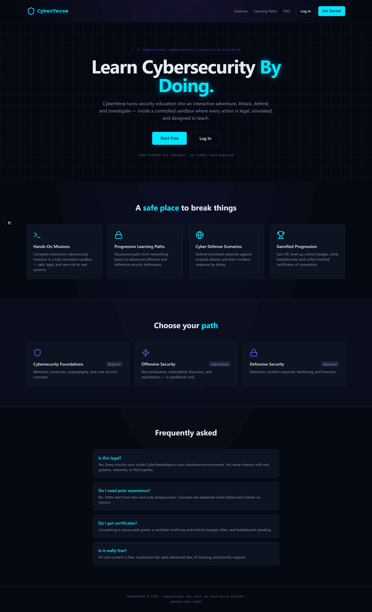
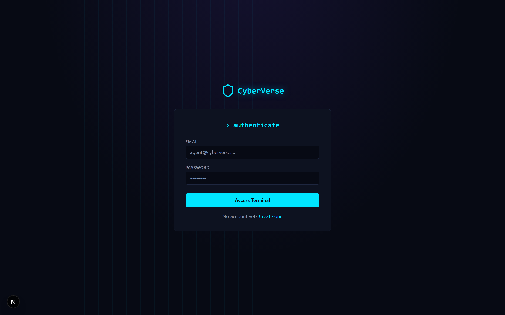
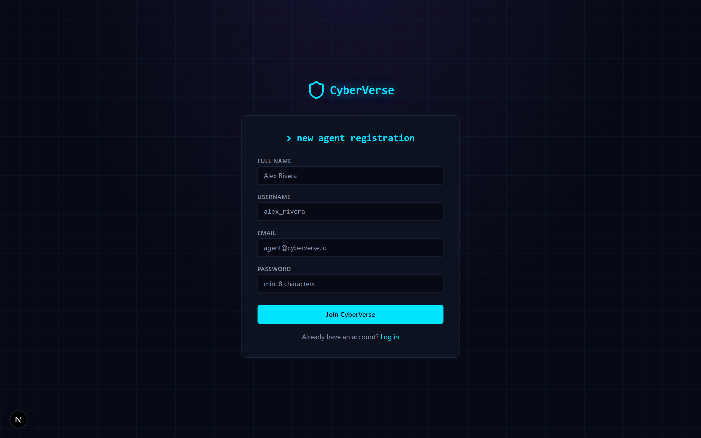
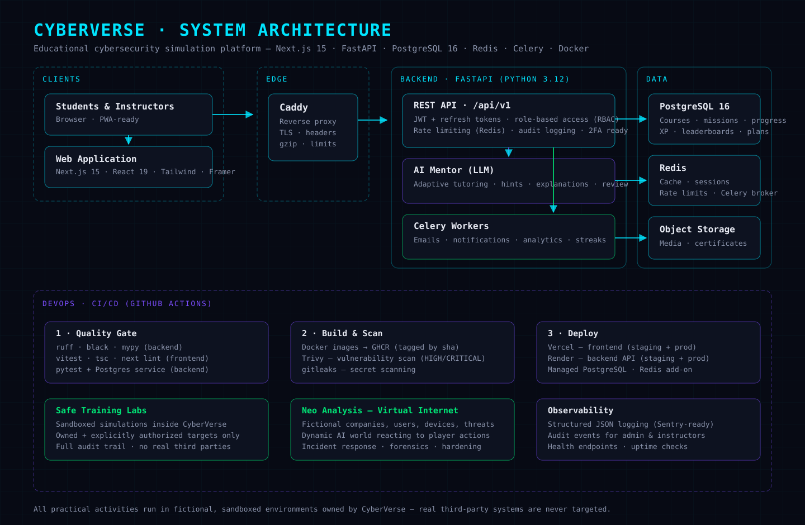

<p align="center">
  
</p>

<h1 align="center">🛡️ CyberVerse</h1>

<p align="center">
  <strong>Learn cybersecurity through immersive, fictional simulations</strong><br />
  Story-driven missions · gamified learning paths · AI mentor · safe training labs
</p>

<p align="center">
  <a href="https://img.shields.io/github/stars/ashrafhacker/CyberVerse"></a>
  <a href="https://img.shields.io/github/forks/ashrafhacker/CyberVerse"></a>
  <a href="https://img.shields.io/github/last-commit/ashrafhacker/CyberVerse"></a>
</p>

<p align="center">
  
  
  
  
  
  
  
  
  
</p>

---

## 🎯 What is CyberVerse?

CyberVerse is a **production-ready educational platform** that turns cybersecurity learning into a game. Students level up through courses, missions, and labs inside a fully fictional, sandboxed world — guided by an AI mentor and motivated by XP, coins, streaks, and leaderboards.

> 🔒 **Safety first**: every practical activity happens in CyberVerse's own simulated environments or labs you own and explicitly authorize. Real third-party systems are never targeted.

## ✨ Highlights

| | |
|---|---|
| 🎮 **Gamified learning** — XP, levels, coins, streaks, achievements, leaderboards | 🤖 **AI mentor** — adaptive tutoring, hints, explanations, decision review |
| 📚 **Learning paths** — structured courses, modules, lessons, quizzes | 🎯 **Missions** — story-driven objectives with real validation rules |
| 👨‍🏫 **Instructor authoring** — create courses, modules, lessons, quizzes, track student progress | 🛡️ **Safe labs** — owned + authorized targets only, full audit trail |
| 🌐 **Neo Analysis** — a dynamic virtual internet of fictional companies that reacts to you | 🔐 **Auth & RBAC** — JWT + refresh tokens, roles from student to super admin |

## 📸 Screenshots

<table>
  <tr>
    <td align="center"></td>
    <td align="center"></td>
  </tr>
  <tr>
    <td align="center"><sub>Login</sub></td>
    <td align="center"><sub>Create account</sub></td>
  </tr>
</table>

## 🏗️ Architecture



## 🛠️ Tech Stack

| Layer | Technology |
|---|---|
| **Frontend** | Next.js 15 (App Router) · React 19 · TypeScript · Tailwind CSS · Framer Motion |
| **Backend** | FastAPI · Python 3.12 · SQLAlchemy 2.0 (async) · Pydantic v2 |
| **Database** | PostgreSQL 16 · Alembic migrations |
| **Async** | Redis 7 (cache, sessions, rate limits) · Celery (emails, notifications, analytics) |
| **Auth** | JWT access + refresh tokens · RBAC · 2FA-ready · device sessions |
| **Infra** | Docker Compose · Caddy · GitHub Actions · Vercel (frontend) · Render (backend) |

## 🚀 Quick Start

**Prerequisites:** Node.js 22+, Python 3.12+, Docker + Docker Compose.

```bash
# 1. Infrastructure (PostgreSQL + Redis)
docker compose -f docker/docker-compose.dev.yml up -d postgres redis

# 2. Backend
cd backend
python -m venv .venv
source .venv/bin/activate        # Windows: .venv\Scripts\activate
pip install -r requirements.txt
cp .env.example .env             # set SECRET_KEY + JWT_SECRET_KEY (min 32 chars)
alembic upgrade head             # apply migrations

# 3. Seed baseline content (admin: admin@cyberverse.io / ChangeMe123!)
cd ..
python scripts/seed.py

# 4. Run the backend (terminal 1)
cd backend
uvicorn app.main:app --reload    # http://localhost:8000/docs

# 5. Run the frontend (terminal 2)
cd frontend
npm install
npm run dev                      # http://localhost:3000
```

Or run the whole stack with Docker: `docker compose -f docker/docker-compose.dev.yml up -d`

## 📦 Project Structure

```
CyberVerse/
├── backend/            # FastAPI application
│   ├── app/
│   │   ├── api/v1/     # Endpoints: auth, courses, missions, progress, admin, instructor…
│   │   ├── core/       # Config, security, database, redis, celery, logging
│   │   ├── models/     # SQLAlchemy models (19 tables)
│   │   ├── schemas/    # Pydantic schemas
│   │   ├── services/   # Business logic
│   │   └── tasks/      # Celery tasks
│   ├── alembic/        # Migrations
│   └── tests/          # pytest suite (Postgres-backed)
├── frontend/           # Next.js 15 application
│   ├── app/            # Pages: dashboard, courses, missions, leaderboard, profile, admin…
│   ├── components/     # UI components (+ unit tests)
│   └── lib/            # API client, auth provider, types
├── database/           # Bootstrap schema
├── docker/             # Dockerfiles + compose (dev/prod)
├── devops/             # CI/CD + Caddy config
├── docs/               # Architecture, API, security, deployment docs
└── scripts/            # seed.py and utilities
```

## 🧪 Testing

```bash
# Backend (needs a local PostgreSQL 16)
cd backend && pytest

# Frontend
cd frontend && npm test
```

CI runs everything on every push: lint, type checks, backend tests against a real Postgres service, 30+ frontend unit tests, Trivy + gitleaks scans.

## 🌐 Neo Analysis — The Virtual Internet

The flagship simulation layer: a complete **virtual internet** of fictional banks, hospitals, data centers, and smart cities — with employees, email, DNS, Active Directory, logs, alerts, and backups. Everything reacts to player actions in real time.

- **Dynamic AI world** — procedurally generated companies, users, devices, and threat timelines
- **Real defensive work** — investigate alerts, review logs, analyze malware in sandboxes, configure firewalls, patch systems, perform forensics
- **AI mentor** — explains, teaches, and adapts missions to your skill level
- **Safe Training Labs** — connect your own VMs or home labs after **mandatory ownership verification** and scope declaration

Read the full design in [docs/neo-analysis.md](docs/neo-analysis.md).

## 📖 Documentation

- [Architecture guide](docs/architecture.md)
- [API reference](docs/api.md)
- [Database schema](docs/database.md)
- [Security guide](docs/security.md)
- [Deployment guide](docs/deployment.md)
- [Game design](docs/game-design.md)
- [Roadmap](docs/roadmap.md)

## 🗺️ Roadmap

| Phase | Focus |
|---|---|
| **v1** (current) | Learning platform core: auth, gamification, courses, missions, leaderboard |
| **v1.5** | Instructor authoring, analytics dashboards, certificate engine |
| **v2** | Neo Analysis virtual internet, AI mentor deep integration, safe labs |
| **v3** | 3D game client, multiplayer co-op sessions, mobile apps |

## 🤝 Contributing

1. Fork the repository
2. Create a feature branch (`git checkout -b feature/amazing-feature`)
3. Commit your changes
4. Push to the branch
5. Open a Pull Request

## 🙏 Acknowledgments

Built with FastAPI, Next.js, PostgreSQL, Redis, Celery, Tailwind CSS — and a lot of fictional sandboxes.

---

<p align="center"><sub>CyberVerse — Learn cybersecurity through immersive simulation.</sub></p>
