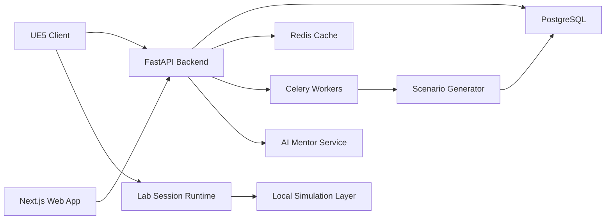

# CyberVerse Labs

CyberVerse Labs is the premium built-in cybersecurity training layer for CyberVerse. It turns the existing learning platform into an Unreal Engine 5 simulation campus where players investigate, defend, recover, and report on incidents in fictional or explicitly authorized environments.

All built-in lab activity is defensive and isolated. CyberVerse does not provide tooling to target arbitrary third-party systems. Any optional external connection must require ownership or authorization attestation, declared scope, local-only agents, audit logging, and a hard deny for public internet target selection.

## Product Pillars

- Real work feel: players use believable SOC dashboards, SIEM searches, endpoint consoles, evidence lockers, case notes, timelines, cloud panels, and ticket queues.
- Safe by design: all default systems, companies, users, malware, logs, indicators, IPs, domains, and evidence are fictional or intentionally generated for training.
- Replayable training: scenario seeds vary company profile, topology, users, device inventory, alerts, misconfigurations, evidence, and scoring rubrics.
- Defensive outcomes: every exercise ends in investigation, containment, remediation, secure configuration, report writing, or resilience planning.
- Multiplayer-ready: missions support solo play, instructor-led rooms, and co-op analyst teams with role-based objectives.

## UE5 Implementation Plan

### Phase 1: Vertical Slice

- Build the CyberVerse Training Campus hub in Unreal Engine 5.
- Implement the SOC as the first playable facility.
- Connect UE5 client to existing FastAPI auth, progress, missions, and AI endpoints.
- Add lab session start/resume/complete flows.
- Ship three defensive missions:
  - suspicious login investigation
  - phishing email triage
  - endpoint malware alert analysis using harmless simulated artifacts

### Phase 2: Enterprise Network Lab

- Add explorable headquarters, branch office, remote worker apartment, data center, and cloud operations room.
- Generate device inventory, users, identity data, services, and logs from scenario seeds.
- Implement topology viewer, firewall policy viewer, AD-style identity console, DNS/DHCP consoles, file/email/web/database/server panels, Wi-Fi, IoT, cameras, and printers.
- Add asset discovery, configuration review, patch management, and hardening missions.

### Phase 3: Forensics, Malware, Cloud, Secure Coding

- Add Digital Forensics Lab with disk image, memory dump, browser history, file recovery, log, email, mobile, evidence, and reporting workflows.
- Add Malware Analysis Lab using non-executable toy samples, static feature inspection, behavior simulation, process/registry/network telemetry, IOC extraction, YARA practice, and detection engineering.
- Add Cloud Security Lab with fictional IAM, storage, VM, container, Kubernetes, logging, monitoring, secrets, security group, and policy data.
- Add Secure Coding Lab for Python, JavaScript, Java, C#, and C++ with vulnerable demo snippets, patch tasks, automated tests, and mentor review.

### Phase 4: AI Scenario Generator

- Promote authored missions into templates.
- Generate scenario variants through constrained JSON schemas and deterministic validators.
- Add instructor controls for difficulty, domains, compliance themes, and mission length.
- Add debrief generation, quiz generation, and career-path recommendations.

### Phase 5: Multiplayer and Live Ops

- Add team rooms, synchronized evidence boards, shared case timelines, analyst roles, voice/text hooks, and instructor observer mode.
- Add seasonal lab campaigns, certification paths, rotating daily briefings, leaderboards, and challenge archives.

## World Layout

The UE5 world is a training campus built around a central operations atrium. Each facility is a diegetic space with interactable workstations, wall displays, briefing rooms, evidence lockers, and instructor terminals.

| Area | Purpose | Key Interactions |
|---|---|---|
| Operations Atrium | Navigation hub and player profile | mission board, progress wall, AI mentor kiosk, certification display |
| Security Operations Center | Daily defensive operations | SIEM, alert queue, endpoint console, email security, threat intel, case management |
| Enterprise Network Lab | Fictional company environment | topology map, asset inventory, identity console, network devices, servers, cloud links |
| Digital Forensics Lab | Evidence handling and analysis | disk timeline, memory viewer, file recovery, browser history, mobile case console |
| Malware Analysis Lab | Harmless training sample analysis | static traits, sandbox replay, IOC extraction, YARA, detection rule validation |
| Cloud Security Lab | Cloud posture review | IAM, storage, compute, Kubernetes, secrets, logging, security groups |
| Secure Coding Lab | Code review and remediation | IDE terminal, vulnerable code, tests, mentor review, secure patterns |
| Network Defense Lab | Hardening and response drills | firewall policies, patch board, secure configuration, recovery planning |
| Briefing Theater | Daily/weekly briefings | threat briefings, instructor broadcasts, mission debriefs |

## Core Lab Architecture

### UE5 Modules

- `CyberVerseLabs`: facility streaming, interactables, workstation widgets, mission orchestration.
- `CyberVerseSOC`: SIEM, alerts, timeline, evidence, cases, threat intel, endpoint and email consoles.
- `CyberVerseEnterprise`: topology rendering, device profiles, network services, identity, office/data center environments.
- `CyberVerseForensics`: evidence browser, timeline analysis, disk/memory/mobile/email investigation tools.
- `CyberVerseMalwareLab`: static sample viewer, sandbox replay, IOC extraction, YARA and detection validation.
- `CyberVerseCloudLab`: cloud posture, IAM graph, Kubernetes/resource panels, remediation tasks.
- `CyberVerseSecureCoding`: embedded code editor, unit test runner integration, secure coding review UI.
- `CyberVerseMentor`: AI guidance, hints, debrief, quiz, adaptive difficulty, career coach.
- `CyberVerseMultiplayer`: co-op rooms, replicated mission state, analyst roles, evidence locks.

### Runtime Model

- A lab session is created by the backend from a mission template and scenario seed.
- UE5 streams the relevant facility and requests the generated world state.
- The local simulation layer renders devices, logs, alerts, files, users, policies, and evidence as game data.
- Player actions submit structured events to the backend.
- Scoring services validate objectives without requiring real network activity.
- AI mentor responses are grounded in the session state and constrained to defensive guidance.

## Security Operations Center

The SOC is the first flagship facility.

### Workstations

- Live security dashboard with alert volume, severity, affected assets, SLA timers, and risk score.
- Simulated SIEM with saved searches, log pivots, correlation rules, and timeline bookmarks.
- Threat intelligence panel with fictional IOCs, actor profiles, tactics, techniques, and recommended detections.
- AI-generated alerts constrained to the fictional environment.
- Endpoint monitoring console with process tree, file events, network connections, user sessions, and isolation status.
- Email security console with message headers, attachment metadata, URL reputation, mailbox triage, and quarantine.
- Incident queue with severity, owner, SLA, status, comments, and escalation.
- Investigation timeline with analyst notes, evidence links, system events, and containment actions.
- Evidence collection with chain of custody metadata.
- Case management with findings, impact, remediation, executive summary, and closure.
- Team collaboration with assignments, chat, pings, and shared evidence board.
- Daily security briefings generated from active fictional campaigns and player progress.

### SOC Mission Loop

1. Briefing: player receives business context, alert, and expected outcome.
2. Triage: player reviews severity, affected asset, user identity, and alert evidence.
3. Investigation: player pivots through SIEM, endpoint, email, identity, network, and cloud data.
4. Containment: player performs safe simulated actions such as disable account, quarantine email, isolate endpoint, block IOC, rotate secret, or open ticket.
5. Remediation: player fixes misconfigurations, patches vulnerable demo systems, or updates detections.
6. Report: player writes a concise incident report.
7. Debrief: mentor reviews decisions, teaches missed concepts, awards XP, and recommends next missions.

## Enterprise Network Lab

The generated enterprise includes headquarters, branch offices, remote workers, data center, cloud infrastructure, VPN, AD-style identity, DNS, DHCP, email, file, web, database, Linux, Windows, firewalls, routers, switches, Wi-Fi, IoT, security cameras, and printers.

Every generated device includes:

- unique fictional hostname, owner, location, department, tags, and criticality
- OS/platform, service list, ports, software versions, patch state, and configuration state
- realistic but fictional users, groups, service accounts, permissions, and activity history
- logs for auth, DNS, DHCP, web, mail, endpoint, firewall, VPN, EDR, cloud, and application events
- relationships to other assets, identities, tickets, alerts, and evidence
- defensible remediation actions and validation criteria

## Digital Forensics Lab

Forensics scenarios use synthetic evidence packages with hashes, custody records, and immutable source snapshots.

Supported activities:

- disk image timeline reconstruction
- memory dump process/module/socket review
- file recovery from intentionally prepared training images
- browser history and download review
- unified timeline analysis
- server, endpoint, VPN, email, and cloud log investigation
- email header and attachment investigation
- mobile device artifact review using fictional app/user data
- evidence management with chain of custody
- report writing with technical and executive sections

## Malware Analysis Lab

The Malware Analysis Lab never executes or distributes real malware. Samples are harmless training artifacts and behavior is shown through simulation replay.

Supported activities:

- static metadata review: strings, imports, sections, entropy, resources, signatures
- behavior replay: process creation, file writes, registry changes, DNS, HTTP, and C2-like beacons using reserved fictional domains
- network activity review through generated PCAP-like event tables
- process inspection and parent-child process trees
- registry review using synthetic Windows artifact data
- IOC extraction and confidence tagging
- YARA rule practice against harmless fixtures
- detection engineering with test events and rule validation

## Cloud Security Lab

The Cloud Security Lab presents fictional cloud tenants with:

- identity management, users, groups, roles, and service principals
- object storage, public access posture, encryption, and lifecycle rules
- virtual machines, images, disks, tags, patch state, and exposed services
- containers and Kubernetes clusters with RBAC, network policy, secrets, and audit logs
- logging, monitoring, alerting, and retention settings
- secrets management and rotation workflows
- security groups, network ACLs, and policy simulators
- IAM policies with least-privilege remediation tasks

## Secure Coding Lab

The Secure Coding Lab supports Python, JavaScript, Java, C#, and C++.

Each exercise includes:

- intentionally vulnerable demo code contained inside CyberVerse fixtures
- safe unit tests and security tests
- clear objectives focused on remediation, input validation, authentication, authorization, secrets handling, memory safety, dependency hygiene, and logging
- mentor review that explains the vulnerability class and verifies the fix
- score based on tests, minimality, secure pattern adoption, and code clarity

## Network Defense Lab

Players perform:

- asset discovery from fictional telemetry
- configuration review for servers, network devices, cloud assets, and identity
- firewall and security group policy review
- patch management planning and validation
- secure configuration baselining
- threat detection and alert tuning
- incident response tabletop and technical containment
- recovery planning, backup validation, and business continuity exercises

## AI Scenario Generator

The generator creates bounded fictional scenarios from approved templates.

### Inputs

- player skill profile and recent mistakes
- requested mission type and facility
- company size, industry, region, maturity, and compliance theme
- topology density and asset mix
- allowed event families and defensive learning objectives
- difficulty, time limit, hint policy, and multiplayer size

### Generated Data

- company profile, employees, departments, roles, and vendors
- network topology, devices, services, and cloud resources
- user activity, logs, alerts, tickets, emails, evidence, and timelines
- misconfigurations, policy violations, simulated insider incidents, phishing campaigns, ransomware simulations, cloud events, compliance tasks
- objectives, scoring rules, hints, debrief rubric, and quiz questions

### Guardrails

- no real targets, credentials, exploit instructions, live malware, or public scanning workflows
- reserved domains, private address ranges, fictional company names, and synthetic identities only
- generated missions must pass validators before publication
- mentor answers use the current lab state and emphasize defensive decisions, reporting, and remediation

## Mission Framework

Each mission is stored as a template plus a generated instance.

### Mission Types

- incident response
- threat hunting
- vulnerability management
- log analysis
- security hardening
- risk assessment
- compliance review
- digital forensics
- disaster recovery
- business continuity
- secure architecture review
- blue team exercises

### Mission Contract

- story context
- facility and required tools
- scenario seed
- objectives and optional stretch goals
- AI guidance level and hint budget
- evidence package
- scoring weights
- debrief rubric
- learning summary
- recommended next lessons

### Scoring

- triage accuracy
- evidence quality
- investigation path efficiency
- containment correctness
- remediation completeness
- report clarity
- collaboration quality
- hint usage
- time and SLA performance
- false-positive and false-negative handling

## AI Mentor

The mentor appears as a diegetic assistant across workstations and briefings.

Capabilities:

- explain concepts at novice, intermediate, and professional depth
- demonstrate workflows using fictional examples from the current mission
- review completed missions and identify decision quality
- recommend next lessons, labs, and career milestones
- generate quizzes from completed evidence
- adapt difficulty, hint volume, and mission complexity
- provide career guidance for SOC analyst, DFIR, cloud security, detection engineering, AppSec, and security architecture

The mentor must not provide instructions for attacking third-party systems or deploying real malware. When a player asks outside the lab scope, it redirects to safe defensive practice.

## Optional Home Lab Integration

External environments are optional and disabled by default.

Allowed connections:

- local virtual machines
- Docker-based labs
- personal Kubernetes clusters
- self-hosted practice environments
- CTF labs
- intentionally vulnerable training targets

Required controls:

- ownership or explicit authorization attestation before each connection profile is activated
- declared CIDR, hostnames, ports, lab purpose, and expiration date
- local agent that refuses public internet ranges unless explicitly marked as a private training provider integration
- read-only mode by default
- no arbitrary target entry in built-in missions
- audit logs for every connection, scan, command, and imported artifact
- emergency disconnect and profile revocation

## Progression

CyberVerse Labs extends the existing progression system with:

- XP and level rewards
- facility mastery tracks
- achievements and badges
- lab certifications
- skill trees by role
- mission history
- lab completion state
- AI feedback summaries
- career profile and portfolio-ready reports

Example certifications:

- SOC Analyst Foundations
- Incident Response Operator
- Digital Forensics Associate
- Cloud Security Reviewer
- Secure Coding Defender
- Detection Engineering Practitioner
- Network Defense Specialist

## UI/UX

### UE5

- First-person or over-the-shoulder campus navigation.
- Workstations open focused professional tools as diegetic panels.
- Wall displays show team status, incident timelines, and high-level telemetry.
- Evidence and notes persist across workstations.
- The mentor is available contextually, with hint budget visible before use.

### Web

- Dashboard shows active lab sessions, career path, certifications, mission history, and reports.
- Instructors manage classes, assign lab missions, review evidence, and export grades.
- Admins manage scenario templates, safety validators, feature flags, and audit logs.

### Accessibility

- Keyboard/gamepad navigation for all mission-critical UI.
- Subtitles for briefings and mentor voice.
- Colorblind-safe severity encoding with icon and text alternatives.
- Adjustable text size, motion reduction, and high contrast modes.

## Save System

- Local UE5 save cache stores graphics settings, input settings, and resumable session pointers.
- Authoritative progress lives in PostgreSQL.
- Mission sessions persist objective status, evidence collected, notes, timeline bookmarks, tool state, AI mentor interactions, score events, and co-op assignments.
- Save conflict policy favors server state and records client deltas for review.
- Offline practice mode may use prepackaged scenarios, then sync only progress summaries when online.

## Multiplayer-Ready Architecture

- Lab sessions have roles: lead analyst, triage analyst, endpoint analyst, cloud analyst, forensics analyst, instructor observer.
- Mission state is authoritative on the backend.
- UE5 replicates avatar position, facility presence, workstation occupancy, shared notes, and evidence board changes.
- Objective submissions are idempotent and event-sourced.
- Evidence locks prevent accidental overwrites during co-op analysis.
- Instructors can pause, inject hints, review timelines, and grade reports.

## Automated Testing

### Backend

- unit tests for scenario generation, validators, scoring, and safety policy checks
- API tests for session lifecycle, objectives, evidence, reports, and home lab attestation
- property tests for generated topologies and log consistency
- migration tests for schema upgrades

### UE5

- automation specs for facility loading, workstation interactions, mission start/resume/complete, and save restore
- widget tests for SOC, SIEM, evidence, and report panels
- network tests for co-op state replication and reconnect
- performance tests for large generated enterprises

### AI

- schema conformance tests
- safety red-team tests against off-scope targeting requests
- deterministic replay tests using fixed scenario seeds
- mentor grounding tests that verify answers reference fictional session data

## Documentation Set

- Player manual: campus, labs, safety rules, mission flow, reporting.
- Instructor manual: assigning labs, grading, debriefing, class management.
- Admin manual: scenario templates, safety validation, audit, moderation.
- UE5 developer guide: modules, streaming, UI widgets, replication, save hooks.
- Backend developer guide: database models, APIs, scenario services, scoring.
- AI guide: prompt contracts, JSON schemas, validators, safety rules.
- Content authoring guide: mission templates, evidence packs, scoring rubrics.

## Initial Backlog

1. Add database migration for labs, sessions, evidence, reports, scenario seeds, home lab attestations, and generated assets.
2. Add FastAPI `labs` router with session lifecycle, generated world state, objective submission, evidence, notes, and debrief endpoints.
3. Build scenario generator service with deterministic seed and validators.
4. Implement SOC vertical slice in UE5 with SIEM, alert queue, endpoint, email, case, and timeline tools.
5. Add three synthetic SOC missions and one instructor grading flow.
6. Add automated backend tests for mission generation, scoring, and safety boundaries.
7. Add frontend lab dashboard and mission history pages.
