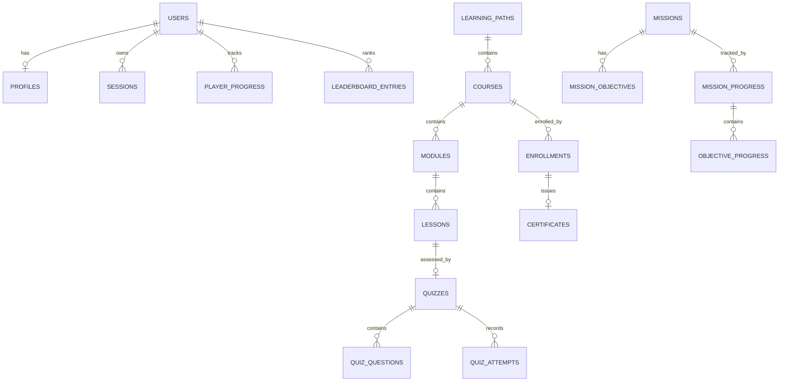

# CyberVerse Database

PostgreSQL 16. ~30 tables managed by **Alembic**. Production uses Supabase Postgres.

## Schema Management

```bash
# Generate a new migration after model changes
alembic revision --autogenerate -m "describe change"

# Apply migrations
alembic upgrade head

# Rollback one step
alembic downgrade -1

# Local bootstrap (dev only — never in production)
psql -U cyberverse -d cyberverse -f ../database/schema.sql
```

## Domain Map

```
Identity & Security          Gamification & Learning
┌──────────────────────┐    ┌──────────────────────────┐
│ users                │    │ player_progress          │
│ profiles             │    │ lesson_progress          │
│ sessions             │    │ enrollments              │
│ login_history        │    │ learning_streaks         │
│ devices              │    │ achievements             │
│ audit_logs           │    │ user_achievements        │
└──────────────────────┘    │ daily_challenges         │
                            │ weekly_challenges        │
Content                      │ leaderboards             │
┌──────────────────────┐    │ leaderboard_entries      │
│ learning_paths       │    │ inventory_items          │
│ courses              │    └──────────────────────────┘
│ modules              │
│ lessons              │    Missions & Sandbox
│ quizzes              │    ┌──────────────────────────┐
│ quiz_questions       │    │ missions                 │
│ quiz_attempts        │    │ mission_objectives       │
│ certificates         │    │ mission_progress         │
│ certificate_templates│    │ objective_progress       │
└──────────────────────┘    │ mission_rewards          │
                            └──────────────────────────┘
Social & Billing             Operations
┌──────────────────────┐    ┌──────────────────────────┐
│ friends               │    │ notifications            │
│ teams                 │    │ announcements            │
│ team_members          │    │ support_tickets          │
│ chat_messages         │    │ ticket_messages          │
│ subscription_plans    │    │ faq_items                │
│ subscriptions         │    │ app_settings             │
│ payments              │    │ feature_flags            │
│ coupons               │    │ analytics_events         │
└──────────────────────┘    │ encyclopedia_articles    │
                            └──────────────────────────┘
```

## Key Relationships



## Conventions

- UUID primary keys (`uuid4`, server default via app layer)
- `created_at` / `updated_at` timestamptz on every table
- Enums stored as VARCHAR with CHECK via `native_enum=False` (portable across Postgres/SQLite tests)
- JSONB for flexible content (`content`, `metadata`, `options`, `statistics`)
- `ON DELETE CASCADE` for owned children; `SET NULL` for optional references
- Unique constraints: `users.email`, `profiles.username`, `learning_paths.slug`, `courses.slug`, `(user_id, lesson_id)`, `(user_id, course_id)`, `(user_id, streak_date)`

## Indexing Strategy

- All FK columns indexed (queries always join/filter by user_id, course_id, etc.)
- Composite indexes for ordering: `(course_id, order)` on modules/lessons, `(quiz_id, order)` on questions
- `leaderboard_entries(leaderboard_id, score DESC)` for rank reads
- `analytics_events(event_name, created_at)` for funnel queries

## Migration Workflow

1. Edit models in `backend/app/models/*.py`
2. `alembic revision --autogenerate -m "..."` and **review the generated diff**
3. Test `upgrade head` against a scratch database
4. Commit model + migration together

> Note: `0001_initial.py` is the baseline. If you modify models, create new migration files — do not edit `0001` after it has shipped.
